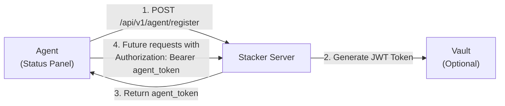

# Agent Registration Specification

## Overview

The **Agent Registration API** allows Status Panel agents running on deployed systems to register themselves with the Stacker control plane. Upon successful registration, agents receive authentication credentials (JWT token) that they use for all subsequent API calls.

This document provides comprehensive guidance for developers implementing agent clients.

---

## Quick Start

### Registration Flow (3 Steps)



### Deployment Flow (Ansible Pre-Deploy)

**Context:** Registration happens **before** the Status Panel agent binary is deployed to the target server. The Ansible playbook performs registration against Stacker and writes credentials into a `.env` file that the agent will later consume.

**Steps:**
- Gather `deployment_hash`, `agent_version`, `capabilities`, and optional `system_info`
- `POST /api/v1/agent/register` to Stacker
- Persist returned `agent_id` and `agent_token` into the agent host’s `.env`

**.env placeholders (written by Ansible):**
```
AGENT_ID=<filled-by-stacker-registration>
AGENT_TOKEN=<filled-by-stacker-registration>
DEPLOYMENT_HASH=<same-value-used-during-registration>
STACKER_URL=<stacker-base-url>
AGENT_VERSION=<agent-binary-version>
```
> These values are created/filled during Ansible registration and then reused by the Status Panel agent after deployment for authenticated calls to Stacker.

### Minimal Example

**Absolute minimum (empty system_info):**
```bash
curl -X POST http://localhost:8000/api/v1/agent/register \
  -H "Content-Type: application/json" \
  -d '{
    "deployment_hash": "550e8400-e29b-41d4-a716-446655440000",
    "agent_version": "1.0.0",
    "capabilities": ["docker"],
    "system_info": {}
  }'
```

**Recommended (with system info):**
```bash
curl -X POST http://localhost:8000/api/v1/agent/register \
  -H "Content-Type: application/json" \
  -d '{
    "deployment_hash": "550e8400-e29b-41d4-a716-446655440000",
    "agent_version": "1.0.0",
    "capabilities": ["docker", "compose", "logs"],
    "system_info": {
      "os": "linux",
      "arch": "x86_64",
      "memory_gb": 8,
      "docker_version": "24.0.0"
    }
  }'
```

**Response:**
```json
{
  "data": {
    "item": {
      "agent_id": "42",
      "agent_token": "eyJhbGciOiJIUzI1NiIsInR5cCI6IkpXVCJ9...",
      "dashboard_version": "2.0.0",
      "supported_api_versions": ["1.0"]
    }
  },
  "status": 201,
  "message": "Agent registered"
}
```

---

## API Reference

### Endpoint: `POST /api/v1/agent/register`

**Purpose:** Register a new agent instance with the Stacker server.

**Authentication:** None required (public endpoint) *See Security Considerations below*

**Content-Type:** `application/json`

---

## Request Format

### Body Parameters

| Field | Type | Required | Constraints | Description | Example |
|-------|------|----------|-------------|-------------|----------|
| `deployment_hash` | `string` | ✅ **Yes** | Non-empty, max 255 chars, URL-safe preferred | Unique identifier for the deployment/stack instance. Should be stable (doesn't change across restarts). Recommend using UUID or hash-based format. | `"abc123-def456-ghi789"`, `"550e8400-e29b-41d4-a716-446655440000"` |
| `agent_version` | `string` | ✅ **Yes** | Semantic version format (e.g., X.Y.Z) | Semantic version of the agent binary. Used for compatibility checks and upgrade decisions. | `"1.0.0"`, `"1.2.3"`, `"2.0.0-rc1"` |
| `capabilities` | `array[string]` | ✅ **Yes** | Non-empty array, each item: 1-32 chars, lowercase alphanumeric + underscore | List of feature identifiers this agent supports. Used for command routing and capability discovery. Must be non-empty - agent must support at least one capability. | `["docker", "compose", "logs"]`, `["docker", "compose", "logs", "monitoring", "backup"]` |
| `system_info` | `object` (JSON) | ✅ **Yes** | Valid JSON object, can be empty `{}` | System environment details. Server uses this for telemetry, debugging, and agent classification. No required fields, but recommended fields shown below. | `{"os": "linux", "arch": "x86_64"}` or `{}` |
| `public_key` | `string` \| `null` | ❌ **No** | Optional, PEM format if provided (starts with `-----BEGIN PUBLIC KEY-----`) | PEM-encoded RSA public key for future request signing. Currently unused; reserved for security upgrade to HMAC-SHA256 request signatures. | `"-----BEGIN PUBLIC KEY-----\nMIIBIjANBgkq...\n-----END PUBLIC KEY-----"` or `null` |

### `system_info` Object Structure

**Requirement:** `system_info` field accepts any valid JSON object. It can be empty `{}` or contain detailed system information.

**Recommended fields** (all optional):

```json
{
  "system_info": {
    "os": "linux",                       // Operating system: linux, windows, darwin, freebsd, etc.
    "arch": "x86_64",                    // CPU architecture: x86_64, arm64, i386, armv7l, etc.
    "memory_gb": 16,                     // Available system memory (float or int)
    "hostname": "deploy-server-01",      // Hostname or instance name
    "docker_version": "24.0.0",          // Docker engine version if available
    "docker_compose_version": "2.20.0",  // Docker Compose version if available
    "kernel_version": "5.15.0-91",       // OS kernel version if available
    "uptime_seconds": 604800,             // System uptime in seconds
    "cpu_cores": 8,                       // Number of CPU cores
    "disk_free_gb": 50                    // Free disk space available
  }
}
```

**Minimum valid requests:**

```bash
# Minimal with empty system_info
{
  "deployment_hash": "my-deployment",
  "agent_version": "1.0.0",
  "capabilities": ["docker"],
  "system_info": {}
}

# Minimal with basic info
{
  "deployment_hash": "my-deployment",
  "agent_version": "1.0.0",
  "capabilities": ["docker", "compose"],
  "system_info": {
    "os": "linux",
    "arch": "x86_64",
    "memory_gb": 8
  }
}
```
```

---

## Response Format

### Success Response (HTTP 201 Created)

```json
{
  "data": {
    "item": {
      "agent_id": "550e8400-e29b-41d4-a716-446655440000",
      "agent_token": "ABCDEFGHIJKLMNOPQRSTUVWXYZabcdefghijklmnopqrstuvwxyz0123456789-_ABCDEFGHIJKLMNOPQRSTUVWXYZabcdefghijklmnopqrst",
      "dashboard_version": "2.0.0",
      "supported_api_versions": ["1.0"]
    }
  },
  "status": 201,
  "message": "Agent registered"
}
```

**Response Structure:**
- `data.item` - Contains the registration result object
- `status` - HTTP status code (201 for success)
- `message` - Human-readable status message

**Response Fields:**

| Field | Type | Value | Description |
|-------|------|-------|-------------|
| `agent_id` | `string` | UUID format (e.g., `"550e8400-e29b-41d4-a716-446655440000"`) | Server-assigned unique identifier for this agent instance. Stable across restarts. |
| `agent_token` | `string` | 86-character random string (URL-safe: A-Z, a-z, 0-9, `-`, `_`) | Secure bearer token for authenticating future requests. Store securely. |
| `dashboard_version` | `string` | Semantic version (e.g., `"2.0.0"`) | Version of the Stacker control plane. Used for compatibility checks. |
| `supported_api_versions` | `array[string]` | Array of semantic versions (e.g., `["1.0"]`) | API versions supported by this server. Agent should use one of these versions for requests. |

### Error Responses

#### HTTP 400 Bad Request
Sent when:
- Required fields are missing
- Invalid JSON structure
- `deployment_hash` format is incorrect

```json
{
  "data": {},
  "status": 400,
  "message": "Invalid JSON: missing field 'deployment_hash'"
}
```

#### HTTP 409 Conflict
Sent when:
- Agent is already registered for this deployment hash

```json
{
  "data": {},
  "status": 409,
  "message": "Agent already registered for this deployment"
}
```

#### HTTP 500 Internal Server Error
Sent when:
- Database error occurs
- Vault token storage fails (graceful degradation)

```json
{
  "data": {},
  "status": 500,
  "message": "Internal Server Error"
}
```

---

## Implementation Guide

### Step 1: Prepare Agent Information

Gather system details (optional but recommended). All fields in `system_info` are optional.

```python
import platform
import json
import os
import docker
import subprocess

def get_system_info():
    """
    Gather deployment system information.
    
    Note: All fields are optional. Return minimal info if not available.
    Server accepts empty dict: {}
    """
    info = {}
    
    # Basic system info (most reliable)
    info["os"] = platform.system().lower()  # "linux", "windows", "darwin"
    info["arch"] = platform.machine()        # "x86_64", "arm64", etc.
    info["hostname"] = platform.node()
    
    # Memory (can fail on some systems)
    try:
        memory_bytes = os.sysconf('SC_PAGE_SIZE') * os.sysconf('SC_PHYS_PAGES')
        info["memory_gb"] = round(memory_bytes / (1024**3), 2)
    except (AttributeError, ValueError):
        pass  # Skip if not available
    
    # Docker info (optional)
    try:
        client = docker.from_env(timeout=5)
        docker_version = client.version()['Version']
        info["docker_version"] = docker_version
    except Exception:
        pass  # Docker not available or not running
    
    # Docker Compose info (optional)
    try:
        result = subprocess.run(
            ['docker-compose', '--version'],
            capture_output=True,
            text=True,
            timeout=5
        )
        if result.returncode == 0:
            # Parse "Docker Compose version 2.20.0"
            version = result.stdout.split()[-1]
            info["docker_compose_version"] = version
    except (FileNotFoundError, subprocess.TimeoutExpired):
        pass  # Docker Compose not available
    
    return info

def get_agent_capabilities():
    """Determine agent capabilities based on installed tools"""
    capabilities = ["docker", "compose", "logs"]
    
    # Check for additional tools
    if shutil.which("rsync"):
        capabilities.append("backup")
    if shutil.which("curl"):
        capabilities.append("monitoring")
    
    return capabilities
```

### Step 2: Generate Deployment Hash

The deployment hash should be **stable and unique** for each deployment:

```python
import hashlib
import json
import os

def generate_deployment_hash():
    """
    Create a stable hash from deployment configuration.
    This should remain consistent across restarts.
    """
    # Option 1: Hash from stack configuration file
    config_hash = hashlib.sha256(
        open('/opt/stacker/docker-compose.yml').read().encode()
    ).hexdigest()[:16]
    
    # Option 2: From environment variable (set at deploy time)
    env_hash = os.environ.get('DEPLOYMENT_HASH')
    
    # Option 3: From hostname + date (resets on redeploy)
    from datetime import datetime
    date_hash = hashlib.sha256(
        f"{platform.node()}-{datetime.now().date()}".encode()
    ).hexdigest()[:16]
    
    return env_hash or config_hash or date_hash
```

### Step 3: Perform Registration Request

```python
import requests
import json
from typing import Dict, Tuple

class AgentRegistrationClient:
    def __init__(self, server_url: str = "http://localhost:8000"):
        self.server_url = server_url
        self.agent_token = None
        self.agent_id = None
    
    def register(self, 
                 deployment_hash: str,
                 agent_version: str = "1.0.0",
                 capabilities: list = None,
                 system_info: dict = None,
                 public_key: str = None) -> Tuple[bool, Dict]:
        """
        Register agent with Stacker server.
        
        Args:
            deployment_hash (str): Unique deployment identifier. Required, non-empty, max 255 chars.
            agent_version (str): Semantic version (e.g., "1.0.0"). Default: "1.0.0"
            capabilities (list[str]): Non-empty list of capability strings. Required.
                                      Default: ["docker", "compose", "logs"]
            system_info (dict): JSON object with system details. All fields optional.
                               Default: {} (empty object)
            public_key (str): PEM-encoded RSA public key (optional, reserved for future use).
        
        Returns:
            Tuple of (success: bool, response: dict)
        
        Raises:
            ValueError: If deployment_hash or capabilities are empty/invalid
        """
        # Validate required fields
        if not deployment_hash or not deployment_hash.strip():
            raise ValueError("deployment_hash cannot be empty")
        
        if not capabilities or len(capabilities) == 0:
            capabilities = ["docker", "compose", "logs"]
        
        if system_info is None:
            system_info = get_system_info()  # Returns dict (possibly empty)
        
        payload = {
            "deployment_hash": deployment_hash.strip(),
            "agent_version": agent_version,
            "capabilities": capabilities,
            "system_info": system_info
        }
        
        # Add optional public_key if provided
        if public_key:
            payload["public_key"] = public_key
        
        try:
            response = requests.post(
                f"{self.server_url}/api/v1/agent/register",
                json=payload,
                timeout=10
            )
            
            if response.status_code == 201:
                data = response.json()
                self.agent_token = data['data']['item']['agent_token']
                self.agent_id = data['data']['item']['agent_id']
                return True, data
            else:
                return False, response.json()
        
        except requests.RequestException as e:
            return False, {"error": str(e)}
    
    def is_registered(self) -> bool:
        """Check if agent has valid token"""
        return self.agent_token is not None
```

### Step 4: Store and Use Agent Token

After successful registration, store the token securely:

```python
import os
from pathlib import Path

def store_agent_credentials(agent_id: str, agent_token: str):
    """
    Store agent credentials for future requests.
    Use restricted file permissions (0600).
    """
    creds_dir = Path('/var/lib/stacker')
    creds_dir.mkdir(mode=0o700, parents=True, exist_ok=True)
    
    creds_file = creds_dir / 'agent.json'
    
    credentials = {
        "agent_id": agent_id,
        "agent_token": agent_token
    }
    
    with open(creds_file, 'w') as f:
        json.dump(credentials, f)
    
    # Restrict permissions
    os.chmod(creds_file, 0o600)

def load_agent_credentials():
    """Load previously stored credentials"""
    creds_file = Path('/var/lib/stacker/agent.json')
    
    if creds_file.exists():
        with open(creds_file, 'r') as f:
            return json.load(f)
    return None

# In subsequent requests to Stacker API:
creds = load_agent_credentials()
if creds:
    headers = {
        "Authorization": f"Bearer {creds['agent_token']}",
        "Content-Type": "application/json"
    }
    response = requests.get(
        "http://localhost:8000/api/v1/commands",
        headers=headers
    )
```

---

## Signature & Authentication Details

### X-Agent-Signature Header (Future)

The `X-Agent-Signature` header field is **reserved for future use**. Currently, registration requires no signature.

**Future Implementation Plan:**
- Agents will include `X-Agent-Signature` header containing HMAC-SHA256 signature
- Signature will be computed as: `HMAC-SHA256(request_body, agent_secret)`
- Agent secret will be provided during initial registration
- This prevents unauthorized agent registration and request tampering

---

## Capabilities Reference

The `capabilities` array (required, non-empty) indicates which Status Panel features the agent supports.

**Capability values:** Lowercase alphanumeric + underscore, 1-32 characters. Examples:

| Capability | Type | Description | Commands routed |
|------------|------|-------------|------------------|
| `docker` | Core | Docker engine interaction (info, inspect, stats) | `docker_stats`, `docker_info`, `docker_ps` |
| `compose` | Core | Docker Compose operations (up, down, logs) | `compose_up`, `compose_down`, `compose_restart` |
| `logs` | Core | Log streaming and retrieval | `tail_logs`, `stream_logs`, `grep_logs` |
| `monitoring` | Feature | Health checks and metrics collection | `health_check`, `collect_metrics`, `cpu_usage` |
| `backup` | Feature | Backup/snapshot operations | `backup_volume`, `snapshot_create`, `restore` |
| `updates` | Feature | Agent or service updates | `update_agent`, `update_service` |
| `networking` | Feature | Network diagnostics | `ping_host`, `traceroute`, `netstat` |
| `shell` | Feature | Remote shell/command execution | `execute_command`, `run_script` |
| `file_ops` | Feature | File operations (read, write, delete) | `read_file`, `write_file`, `delete_file` |

**Rules:**
- `deployment_hash` must declare at least one capability (array cannot be empty)
- Declare **only** capabilities actually implemented by your agent
- Server uses capabilities for command routing and authorization
- Unknown capabilities are stored but generate warnings in logs

**Examples:**
```json
"capabilities": ["docker"]                              // Minimal
"capabilities": ["docker", "compose", "logs"]          // Standard
"capabilities": ["docker", "compose", "logs", "monitoring", "backup"]  // Full-featured
```

---

## Security Considerations

### ⚠️ Current Security Gap

**Issue:** Agent registration endpoint is currently public (no authentication required).

**Implications:**
- Any client can register agents under any deployment hash
- Potential for registration spam or hijacking

**Mitigation (Planned):**
- Add user authentication requirement to `/api/v1/agent/register`
- Verify user owns the deployment before accepting registration
- Implement rate limiting per deployment

**Workaround (Current):**
- Restrict network access to Stacker server (firewall rules)
- Use deployment hashes that are difficult to guess
- Monitor audit logs for suspicious registrations

### Best Practices

1. **Token Storage**
   - Store agent tokens in secure locations (not in git, config files, or environment variables)
   - Use file permissions (mode 0600) when storing to disk
   - Consider using secrets management systems (Vault, HashiCorp Consul)

2. **HTTPS in Production**
   - Always use HTTPS when registering agents
   - Verify server certificate validity
   - Never trust self-signed certificates without explicit validation

3. **Deployment Hash**
   - Use values derived from deployed configuration (not sequential/predictable)
   - Include stack version/hash in the deployment identifier
   - Avoid generic values like "default", "production", "main"

4. **Capability Declaration**
   - Be conservative: only declare capabilities actually implemented
   - Remove capabilities not in use (reduces attack surface)

---

## Troubleshooting

### Agent Registration Fails with "Already Registered"

**Symptom:** HTTP 409 Conflict after first registration

**Cause:** Agent with same `deployment_hash` already exists in database

**Solutions:**
- Use unique deployment hash: `deployment_hash = "stack-v1.2.3-${UNIQUE_ID}"`
- Clear database and restart (dev only): `make clean-db`
- Check database for duplicates: 
  ```sql
  SELECT id, deployment_hash FROM agent WHERE deployment_hash = 'YOUR_HASH';
  ```

### Vault Token Storage Warning

**Symptom:** Logs show `"Failed to store token in Vault (continuing anyway)"`

**Cause:** Vault service is unreachable (development environment)

**Impact:** Agent tokens fall back to bearer tokens instead of Vault storage

**Fix:**
- Ensure Vault is running: `docker-compose logs vault`
- Check Vault connectivity in config: `curl http://localhost:8200/v1/sys/health`
- For production, ensure Vault address is correctly configured in `.env`

### Agent Token Expired

**Symptom:** Subsequent API calls return 401 Unauthorized

**Cause:** JWT token has expired (default TTL: varies by configuration)

**Fix:**
- Re-register the agent: `POST /api/v1/agent/register` with same `deployment_hash`
- Store the new token and use for subsequent requests
- Implement token refresh logic in agent client

---

## Example Implementations

### Python Client Library

```python
class StacherAgentClient:
    """Production-ready agent registration client"""
    
    def __init__(self, server_url: str, deployment_hash: str):
        self.server_url = server_url.rstrip('/')
        self.deployment_hash = deployment_hash
        self.agent_token = None
        self._load_cached_token()
    
    def _load_cached_token(self):
        """Attempt to load token from disk"""
        try:
            creds = load_agent_credentials()
            if creds:
                self.agent_token = creds.get('agent_token')
        except Exception as e:
            print(f"Failed to load cached token: {e}")
    
    def register_or_reuse(self, agent_version="1.0.0"):
        """Register new agent or reuse existing token"""
        
        # If we have a cached token, assume we're already registered
        if self.agent_token:
            return self.agent_token
        
        # Otherwise, register
        success, response = self.register(agent_version)
        
        if not success:
            raise RuntimeError(f"Registration failed: {response}")
        
        return self.agent_token
    
    def request(self, method: str, path: str, **kwargs):
        """Make authenticated request to Stacker API"""
        
        if not self.agent_token:
            raise RuntimeError("Agent not registered. Call register() first.")
        
        headers = kwargs.pop('headers', {})
        headers['Authorization'] = f'Bearer {self.agent_token}'
        
        url = f"{self.server_url}{path}"
        
        response = requests.request(method, url, headers=headers, **kwargs)
        
        if response.status_code == 401:
            # Token expired, re-register
            self.register()
            headers['Authorization'] = f'Bearer {self.agent_token}'
            response = requests.request(method, url, headers=headers, **kwargs)
        
        return response

# Usage
client = StacherAgentClient(
    server_url="https://stacker.example.com",
    deployment_hash=generate_deployment_hash()
)

# Register or reuse token
token = client.register_or_reuse(agent_version="1.0.0")

# Use for subsequent requests
response = client.request('GET', '/api/v1/commands')
```

### Rust Client

```rust
use reqwest::Client;
use serde::{Deserialize, Serialize};

#[derive(Serialize)]
struct RegisterRequest {
    deployment_hash: String,
    agent_version: String,
    capabilities: Vec<String>,
    system_info: serde_json::Value,
}

#[derive(Deserialize)]
struct RegisterResponse {
    data: ResponseData,
}

#[derive(Deserialize)]
struct ResponseData {
    item: AgentCredentials,
}

#[derive(Deserialize)]
struct AgentCredentials {
    agent_id: String,
    agent_token: String,
    dashboard_version: String,
    supported_api_versions: Vec<String>,
}

pub struct AgentClient {
    http_client: Client,
    server_url: String,
    agent_token: Option<String>,
}

impl AgentClient {
    pub async fn register(
        &mut self,
        deployment_hash: String,
        agent_version: String,
        capabilities: Vec<String>,
    ) -> Result<AgentCredentials, Box<dyn std::error::Error>> {
        
        let system_info = get_system_info();
        
        let request = RegisterRequest {
            deployment_hash,
            agent_version,
            capabilities,
            system_info,
        };
        
        let response = self.http_client
            .post(&format!("{}/api/v1/agent/register", self.server_url))
            .json(&request)
            .send()
            .await?
            .json::<RegisterResponse>()
            .await?;
        
        self.agent_token = Some(response.data.item.agent_token.clone());
        
        Ok(response.data.item)
    }
}
```

---

## Testing

### Manual Test with curl

**Test 1: Minimal registration (empty system_info)**
```bash
DEPLOYMENT_HASH=$(uuidgen | tr '[:upper:]' '[:lower:]')

curl -X POST http://localhost:8000/api/v1/agent/register \
  -H "Content-Type: application/json" \
  -d "{
    \"deployment_hash\": \"$DEPLOYMENT_HASH\",
    \"agent_version\": \"1.0.0\",
    \"capabilities\": [\"docker\"],
    \"system_info\": {}
  }" | jq '.'
```

**Test 2: Full registration (with system info)**
```bash
DEPLOYMENT_HASH=$(uuidgen | tr '[:upper:]' '[:lower:]')

curl -X POST http://localhost:8000/api/v1/agent/register \
  -H "Content-Type: application/json" \
  -d "{
    \"deployment_hash\": \"$DEPLOYMENT_HASH\",
    \"agent_version\": \"1.0.0\",
    \"capabilities\": [\"docker\", \"compose\", \"logs\"],
    \"system_info\": {
      \"os\": \"linux\",
      \"arch\": \"x86_64\",
      \"memory_gb\": 16,
      \"hostname\": \"deploy-server-01\",
      \"docker_version\": \"24.0.0\",
      \"docker_compose_version\": \"2.20.0\"
    }
  }" | jq '.'
```

**Test 3: Registration with public_key (future feature)**
```bash
DEPLOYMENT_HASH=$(uuidgen | tr '[:upper:]' '[:lower:]')
PUBLIC_KEY=$(cat /path/to/public_key.pem | jq -Rs .)

curl -X POST http://localhost:8000/api/v1/agent/register \
  -H "Content-Type: application/json" \
  -d "{
    \"deployment_hash\": \"$DEPLOYMENT_HASH\",
    \"agent_version\": \"1.0.0\",
    \"capabilities\": [\"docker\", \"compose\"],
    \"system_info\": {},
    \"public_key\": $PUBLIC_KEY
  }" | jq '.'
```

### Integration Test

See [tests/agent_command_flow.rs](tests/agent_command_flow.rs) for full test example.

---

## Related Documentation

- [Architecture Overview](README.md#architecture)
- [Authentication Methods](src/middleware/authentication/README.md)
- [Vault Integration](src/helpers/vault.rs)
- [Agent Models](src/models/agent.rs)
- [Agent Database Queries](src/db/agent.rs)

---

## Feedback & Questions

For issues or clarifications about this specification, see:
- TODO items: [TODO.md](TODO.md#agent-registration--security)
- Architecture guide: [Copilot Instructions](.github/copilot-instructions.md)
