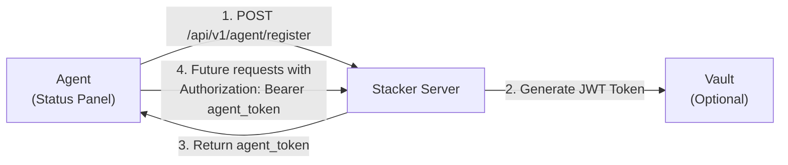

# Agent Registration Specification

## Overview

The **Agent Registration API** allows Status Panel agents running on deployed systems to register themselves with the Stacker control plane. Upon successful registration, agents receive authentication credentials (JWT token) that they use for all subsequent API calls.

This document provides comprehensive guidance for developers implementing agent clients.

---

## Quick Start

### Registration Flow (3 Steps)



### Deployment Flow (Ansible Pre-Deploy)

**Context:** Registration happens **before** the Status Panel agent binary is deployed to the target server. The Ansible playbook performs registration against Stacker and writes credentials into a `.env` file that the agent will later consume.

**Steps:**
- Gather `deployment_hash`, `agent_version`, `capabilities`, and optional `system_info`
- `POST /api/v1/agent/register` to Stacker
- Persist returned `agent_id` and `agent_token` into the agent host’s `.env`
- **NEW:** Configure Vault integration for automatic token rotation (optional but recommended)

**.env placeholders (written by Ansible):**

**Basic Setup (Static Token):**
```
AGENT_ID=<filled-by-stacker-registration>
AGENT_TOKEN=<filled-by-stacker-registration>
DEPLOYMENT_HASH=<same-value-used-during-registration>
STACKER_URL=<stacker-base-url>
AGENT_VERSION=<agent-binary-version>
```

**With Vault Integration (Recommended for Production):**
```
# Registration values (from Stacker)
AGENT_ID=<filled-by-stacker-registration>
AGENT_TOKEN=<initial-token-stored-in-vault>
DEPLOYMENT_HASH=<same-value-used-during-registration>
STACKER_URL=<stacker-base-url>
AGENT_VERSION=<agent-binary-version>

# Vault Integration (for automatic token rotation)
VAULT_ADDRESS=http://127.0.0.1:8200
VAULT_TOKEN=s.xxxxxxxxxxxxxxxx
VAULT_AGENT_PATH_PREFIX=status_panel
```

> **Token Lifecycle:** 
> 1. Registration creates initial token
> 2. Ansible stores token in both `.env` and Vault KV store
> 3. Agent startup: reads `AGENT_TOKEN` from `.env` as fallback
> 4. Agent runs background refresh loop: every 60s fetches fresh token from Vault
> 5. Automatic rotation: if token changes in Vault, agent swaps it atomically
> 6. Zero-downtime: in-flight requests complete with old token, new requests use new token

### Minimal Example

**Absolute minimum (empty system_info):**
```bash
curl -X POST http://localhost:8000/api/v1/agent/register \
  -H "Content-Type: application/json" \
  -d '{
    "deployment_hash": "550e8400-e29b-41d4-a716-446655440000",
    "agent_version": "1.0.0",
    "capabilities": ["docker"],
    "system_info": {}
  }'
```

**Recommended (with system info):**
```bash
curl -X POST http://localhost:8000/api/v1/agent/register \
  -H "Content-Type: application/json" \
  -d '{
    "deployment_hash": "550e8400-e29b-41d4-a716-446655440000",
    "agent_version": "1.0.0",
    "capabilities": ["docker", "compose", "logs"],
    "system_info": {
      "os": "linux",
      "arch": "x86_64",
      "memory_gb": 8,
      "docker_version": "24.0.0"
    }
  }'
```

**Response:**
```json
{
  "data": {
    "item": {
      "agent_id": "42",
      "agent_token": "eyJhbGciOiJIUzI1NiIsInR5cCI6IkpXVCJ9...",
      "dashboard_version": "2.0.0",
      "supported_api_versions": ["1.0"]
    }
  },
  "status": 201,
  "message": "Agent registered"
}
```

---

## API Reference

### Endpoint: `POST /api/v1/agent/register`

**Purpose:** Register a new agent instance with the Stacker server.

**Authentication:** None required (public endpoint) *See Security Considerations below*

**Content-Type:** `application/json`

---

## Request Format

### Body Parameters

| Field | Type | Required | Constraints | Description | Example |
|-------|------|----------|-------------|-------------|----------|
| `deployment_hash` | `string` | ✅ **Yes** | Non-empty, max 255 chars, URL-safe preferred | Unique identifier for the deployment/stack instance. Should be stable (doesn't change across restarts). Recommend using UUID or hash-based format. | `"abc123-def456-ghi789"`, `"550e8400-e29b-41d4-a716-446655440000"` |
| `agent_version` | `string` | ✅ **Yes** | Semantic version format (e.g., X.Y.Z) | Semantic version of the agent binary. Used for compatibility checks and upgrade decisions. | `"1.0.0"`, `"1.2.3"`, `"2.0.0-rc1"` |
| `capabilities` | `array[string]` | ✅ **Yes** | Non-empty array, each item: 1-32 chars, lowercase alphanumeric + underscore | List of feature identifiers this agent supports. Used for command routing and capability discovery. Must be non-empty - agent must support at least one capability. | `["docker", "compose", "logs"]`, `["docker", "compose", "logs", "monitoring", "backup"]` |
| `system_info` | `object` (JSON) | ✅ **Yes** | Valid JSON object, can be empty `{}` | System environment details. Server uses this for telemetry, debugging, and agent classification. No required fields, but recommended fields shown below. | `{"os": "linux", "arch": "x86_64"}` or `{}` |
| `public_key` | `string` \| `null` | ❌ **No** | Optional, PEM format if provided (starts with `-----BEGIN PUBLIC KEY-----`) | PEM-encoded RSA public key for future request signing. Currently unused; reserved for security upgrade to HMAC-SHA256 request signatures. | `"-----BEGIN PUBLIC KEY-----\nMIIBIjANBgkq...\n-----END PUBLIC KEY-----"` or `null` |

### `system_info` Object Structure

**Requirement:** `system_info` field accepts any valid JSON object. It can be empty `{}` or contain detailed system information.

**Recommended fields** (all optional):

```json
{
  "system_info": {
    "os": "linux",                       // Operating system: linux, windows, darwin, freebsd, etc.
    "arch": "x86_64",                    // CPU architecture: x86_64, arm64, i386, armv7l, etc.
    "memory_gb": 16,                     // Available system memory (float or int)
    "hostname": "deploy-server-01",      // Hostname or instance name
    "docker_version": "24.0.0",          // Docker engine version if available
    "docker_compose_version": "2.20.0",  // Docker Compose version if available
    "kernel_version": "5.15.0-91",       // OS kernel version if available
    "uptime_seconds": 604800,             // System uptime in seconds
    "cpu_cores": 8,                       // Number of CPU cores
    "disk_free_gb": 50                    // Free disk space available
  }
}
```

**Minimum valid requests:**

```bash
# Minimal with empty system_info
{
  "deployment_hash": "my-deployment",
  "agent_version": "1.0.0",
  "capabilities": ["docker"],
  "system_info": {}
}

# Minimal with basic info
{
  "deployment_hash": "my-deployment",
  "agent_version": "1.0.0",
  "capabilities": ["docker", "compose"],
  "system_info": {
    "os": "linux",
    "arch": "x86_64",
    "memory_gb": 8
  }
}
```
```

---

## Response Format

### Success Response (HTTP 201 Created)

```json
{
  "data": {
    "item": {
      "agent_id": "550e8400-e29b-41d4-a716-446655440000",
      "agent_token": "ABCDEFGHIJKLMNOPQRSTUVWXYZabcdefghijklmnopqrstuvwxyz0123456789-_ABCDEFGHIJKLMNOPQRSTUVWXYZabcdefghijklmnopqrst",
      "dashboard_version": "2.0.0",
      "supported_api_versions": ["1.0"]
    }
  },
  "status": 201,
  "message": "Agent registered"
}
```

**Response Structure:**
- `data.item` - Contains the registration result object
- `status` - HTTP status code (201 for success)
- `message` - Human-readable status message

**Response Fields:**

| Field | Type | Value | Description |
|-------|------|-------|-------------|
| `agent_id` | `string` | UUID format (e.g., `"550e8400-e29b-41d4-a716-446655440000"`) | Server-assigned unique identifier for this agent instance. Stable across restarts. |
| `agent_token` | `string` | 86-character random string (URL-safe: A-Z, a-z, 0-9, `-`, `_`) | Secure bearer token for authenticating future requests. Store securely. |
| `dashboard_version` | `string` | Semantic version (e.g., `"2.0.0"`) | Version of the Stacker control plane. Used for compatibility checks. |
| `supported_api_versions` | `array[string]` | Array of semantic versions (e.g., `["1.0"]`) | API versions supported by this server. Agent should use one of these versions for requests. |

### Error Responses

#### HTTP 400 Bad Request
Sent when:
- Required fields are missing
- Invalid JSON structure
- `deployment_hash` format is incorrect

```json
{
  "data": {},
  "status": 400,
  "message": "Invalid JSON: missing field 'deployment_hash'"
}
```

#### HTTP 409 Conflict
Sent when:
- Agent is already registered for this deployment hash

```json
{
  "data": {},
  "status": 409,
  "message": "Agent already registered for this deployment"
}
```

#### HTTP 500 Internal Server Error
Sent when:
- Database error occurs
- Vault token storage fails (graceful degradation)

```json
{
  "data": {},
  "status": 500,
  "message": "Internal Server Error"
}
```

---

## Implementation Guide

### Step 1: Prepare Agent Information

Gather system details (optional but recommended). All fields in `system_info` are optional.

```python
import platform
import json
import os
import docker
import subprocess

def get_system_info():
    """
    Gather deployment system information.
    
    Note: All fields are optional. Return minimal info if not available.
    Server accepts empty dict: {}
    """
    info = {}
    
    # Basic system info (most reliable)
    info["os"] = platform.system().lower()  # "linux", "windows", "darwin"
    info["arch"] = platform.machine()        # "x86_64", "arm64", etc.
    info["hostname"] = platform.node()
    
    # Memory (can fail on some systems)
    try:
        memory_bytes = os.sysconf('SC_PAGE_SIZE') * os.sysconf('SC_PHYS_PAGES')
        info["memory_gb"] = round(memory_bytes / (1024**3), 2)
    except (AttributeError, ValueError):
        pass  # Skip if not available
    
    # Docker info (optional)
    try:
        client = docker.from_env(timeout=5)
        docker_version = client.version()['Version']
        info["docker_version"] = docker_version
    except Exception:
        pass  # Docker not available or not running
    
    # Docker Compose info (optional)
    try:
        result = subprocess.run(
            ['docker-compose', '--version'],
            capture_output=True,
            text=True,
            timeout=5
        )
        if result.returncode == 0:
            # Parse "Docker Compose version 2.20.0"
            version = result.stdout.split()[-1]
            info["docker_compose_version"] = version
    except (FileNotFoundError, subprocess.TimeoutExpired):
        pass  # Docker Compose not available
    
    return info

def get_agent_capabilities():
    """Determine agent capabilities based on installed tools"""
    capabilities = ["docker", "compose", "logs"]
    
    # Check for additional tools
    if shutil.which("rsync"):
        capabilities.append("backup")
    if shutil.which("curl"):
        capabilities.append("monitoring")
    
    return capabilities
```

### Step 2: Generate Deployment Hash

The deployment hash should be **stable and unique** for each deployment:

```python
import hashlib
import json
import os

def generate_deployment_hash():
    """
    Create a stable hash from deployment configuration.
    This should remain consistent across restarts.
    """
    # Option 1: Hash from stack configuration file
    config_hash = hashlib.sha256(
        open('/opt/stacker/docker-compose.yml').read().encode()
    ).hexdigest()[:16]
    
    # Option 2: From environment variable (set at deploy time)
    env_hash = os.environ.get('DEPLOYMENT_HASH')
    
    # Option 3: From hostname + date (resets on redeploy)
    from datetime import datetime
    date_hash = hashlib.sha256(
        f"{platform.node()}-{datetime.now().date()}".encode()
    ).hexdigest()[:16]
    
    return env_hash or config_hash or date_hash
```

### Step 3: Perform Registration Request

```python
import requests
import json
from typing import Dict, Tuple

class AgentRegistrationClient:
    def __init__(self, server_url: str = "http://localhost:8000"):
        self.server_url = server_url
        self.agent_token = None
        self.agent_id = None
    
    def register(self, 
                 deployment_hash: str,
                 agent_version: str = "1.0.0",
                 capabilities: list = None,
                 system_info: dict = None,
                 public_key: str = None) -> Tuple[bool, Dict]:
        """
        Register agent with Stacker server.
        
        Args:
            deployment_hash (str): Unique deployment identifier. Required, non-empty, max 255 chars.
            agent_version (str): Semantic version (e.g., "1.0.0"). Default: "1.0.0"
            capabilities (list[str]): Non-empty list of capability strings. Required.
                                      Default: ["docker", "compose", "logs"]
            system_info (dict): JSON object with system details. All fields optional.
                               Default: {} (empty object)
            public_key (str): PEM-encoded RSA public key (optional, reserved for future use).
        
        Returns:
            Tuple of (success: bool, response: dict)
        
        Raises:
            ValueError: If deployment_hash or capabilities are empty/invalid
        """
        # Validate required fields
        if not deployment_hash or not deployment_hash.strip():
            raise ValueError("deployment_hash cannot be empty")
        
        if not capabilities or len(capabilities) == 0:
            capabilities = ["docker", "compose", "logs"]
        
        if system_info is None:
            system_info = get_system_info()  # Returns dict (possibly empty)
        
        payload = {
            "deployment_hash": deployment_hash.strip(),
            "agent_version": agent_version,
            "capabilities": capabilities,
            "system_info": system_info
        }
        
        # Add optional public_key if provided
        if public_key:
            payload["public_key"] = public_key
        
        try:
            response = requests.post(
                f"{self.server_url}/api/v1/agent/register",
                json=payload,
                timeout=10
            )
            
            if response.status_code == 201:
                data = response.json()
                self.agent_token = data['data']['item']['agent_token']
                self.agent_id = data['data']['item']['agent_id']
                return True, data
            else:
                return False, response.json()
        
        except requests.RequestException as e:
            return False, {"error": str(e)}
    
    def is_registered(self) -> bool:
        """Check if agent has valid token"""
        return self.agent_token is not None
```

### Step 4: Store and Use Agent Token

After successful registration, store the token securely:

```python
import os
from pathlib import Path

def store_agent_credentials(agent_id: str, agent_token: str):
    """
    Store agent credentials for future requests.
    Use restricted file permissions (0600).
    """
    creds_dir = Path('/var/lib/stacker')
    creds_dir.mkdir(mode=0o700, parents=True, exist_ok=True)
    
    creds_file = creds_dir / 'agent.json'
    
    credentials = {
        "agent_id": agent_id,
        "agent_token": agent_token
    }
    
    with open(creds_file, 'w') as f:
        json.dump(credentials, f)
    
    # Restrict permissions
    os.chmod(creds_file, 0o600)

def load_agent_credentials():
    """Load previously stored credentials"""
    creds_file = Path('/var/lib/stacker/agent.json')
    
    if creds_file.exists():
        with open(creds_file, 'r') as f:
            return json.load(f)
    return None

# In subsequent requests to Stacker API:
creds = load_agent_credentials()
if creds:
    headers = {
        "Authorization": f"Bearer {creds['agent_token']}",
        "Content-Type": "application/json"
    }
    response = requests.get(
        "http://localhost:8000/api/v1/commands",
        headers=headers
    )
```

---

## Signature & Authentication Details

### X-Agent-Signature Header (Future)

The `X-Agent-Signature` header field is **reserved for future use**. Currently, registration requires no signature.

**Future Implementation Plan:**
- Agents will include `X-Agent-Signature` header containing HMAC-SHA256 signature
- Signature will be computed as: `HMAC-SHA256(request_body, agent_secret)`
- Agent secret will be provided during initial registration
- This prevents unauthorized agent registration and request tampering

---

## Capabilities Reference

The `capabilities` array (required, non-empty) indicates which Status Panel features the agent supports.

**Capability values:** Lowercase alphanumeric + underscore, 1-32 characters. Examples:

| Capability | Type | Description | Commands routed |
|------------|------|-------------|------------------|
| `docker` | Core | Docker engine interaction (info, inspect, stats) | `docker_stats`, `docker_info`, `docker_ps` |
| `compose` | Core | Docker Compose operations (up, down, logs) | `compose_up`, `compose_down`, `compose_restart` |
| `logs` | Core | Log streaming and retrieval | `tail_logs`, `stream_logs`, `grep_logs` |
| `monitoring` | Feature | Health checks and metrics collection | `health_check`, `collect_metrics`, `cpu_usage` |
| `backup` | Feature | Backup/snapshot operations | `backup_volume`, `snapshot_create`, `restore` |
| `updates` | Feature | Agent or service updates | `update_agent`, `update_service` |
| `networking` | Feature | Network diagnostics | `ping_host`, `traceroute`, `netstat` |
| `shell` | Feature | Remote shell/command execution | `execute_command`, `run_script` |
| `file_ops` | Feature | File operations (read, write, delete) | `read_file`, `write_file`, `delete_file` |

**Rules:**
- `deployment_hash` must declare at least one capability (array cannot be empty)
- Declare **only** capabilities actually implemented by your agent
- Server uses capabilities for command routing and authorization
- Unknown capabilities are stored but generate warnings in logs

**Examples:**
```json
"capabilities": ["docker"]                              // Minimal
"capabilities": ["docker", "compose", "logs"]          // Standard
"capabilities": ["docker", "compose", "logs", "monitoring", "backup"]  // Full-featured
```

---

## Vault Integration for Token Rotation

**Status:** ✅ **Production Ready** (as of v2.0)

### Overview

Status Panel Agent supports **automatic token rotation via HashiCorp Vault**, enabling zero-downtime credential management without server restarts.

**Benefits:**
- ✅ Automatic credential rotation every 60 seconds
- ✅ Zero-downtime updates (no agent restart required)
- ✅ Graceful error handling (continues with current token if Vault unavailable)
- ✅ In-flight request safety (old token remains valid during rotation)
- ✅ Compliance-friendly (enables frequent credential rotation)
- ✅ No impact to Stacker clients (transparent rotation)

### Architecture

```
┌─────────────────────────────────────────────────────────────┐
│ Agent Registration Flow with Vault                          │
└─────────────────────────────────────────────────────────────┘

1. STACKER REGISTRATION
   ├─ Ansible: POST /api/v1/agent/register
   ├─ Response: {agent_id, agent_token}
   └─ Store initial token

2. ANSIBLE DEPLOYMENT
   ├─ Write AGENT_TOKEN to agent's .env (fallback)
   ├─ Store AGENT_TOKEN in Vault KV at:
   │  └─ {VAULT_ADDRESS}/v1/{VAULT_AGENT_PATH_PREFIX}/{DEPLOYMENT_HASH}/token
   └─ Deploy Status Panel agent binary

3. AGENT STARTUP
   ├─ Load AGENT_TOKEN from .env (fallback value)
   ├─ Initialize VaultClient (if VAULT_ADDRESS set)
   ├─ Create TokenCache with initial token
   └─ Spawn background refresh loop

4. BACKGROUND REFRESH (every 60s + jitter)
   ├─ Fetch latest token from Vault KV
   ├─ If changed:
   │  ├─ Atomically swap token in cache
   │  ├─ Record rotation timestamp
   │  └─ Log rotation event
   └─ If fetch fails: silently retry next cycle

5. RUNTIME
   ├─ New requests use fresh token from cache
   ├─ In-flight requests complete with old token (still valid)
   └─ No connection drops or 401s
```

### Configuration

#### Ansible Playbook Setup

**Step 1: Perform Registration**
```yaml
- name: Register agent with Stacker
  uri:
    url: "{{ stacker_url }}/api/v1/agent/register"
    method: POST
    body_format: json
    body:
      deployment_hash: "{{ deployment_hash }}"
      agent_version: "{{ agent_version }}"
      capabilities: ["docker", "compose", "logs"]
      system_info:
        os: "{{ ansible_system | lower }}"
        arch: "{{ ansible_machine }}"
        memory_gb: "{{ ansible_memtotal_mb // 1024 }}"
        hostname: "{{ ansible_hostname }}"
        docker_version: "{{ docker_version.stdout | default('') }}"
  register: registration_result
```

**Step 2: Store Token in .env**
```yaml
- name: Write agent credentials to .env
  template:
    src: agent.env.j2
    dest: /opt/agent/.env
    owner: agent
    group: agent
    mode: '0600'
  vars:
    agent_id: "{{ registration_result.json.data.item.agent_id }}"
    agent_token: "{{ registration_result.json.data.item.agent_token }}"
```

**Step 3: Store Token in Vault (Optional but Recommended)**
```yaml
- name: Store initial token in Vault
  community.hcp.vault_generic:
    auth_method: token
    url: "{{ vault_address }}"
    auth_path: auth/token/
    token: "{{ vault_token }}"
    path: "{{ vault_path }}/{{ deployment_hash }}/token"
    data:
      token: "{{ registration_result.json.data.item.agent_token }}"
  when: vault_enabled | default(false)
```

**Step 4: Configure Vault Variables in .env**
```yaml
- name: Write Vault configuration to .env
  blockinfile:
    path: /opt/agent/.env
    marker: "# {mark} VAULT CONFIGURATION"
    block: |
      VAULT_ADDRESS={{ vault_address }}
      VAULT_TOKEN={{ vault_token }}
      VAULT_AGENT_PATH_PREFIX={{ vault_agent_path_prefix }}
  when: vault_enabled | default(false)
```

#### Environment Variables Reference

**Required for Vault Integration:**

| Variable | Value | Example | Notes |
|----------|-------|---------|-------|
| `VAULT_ADDRESS` | Vault base URL | `http://127.0.0.1:8200` | Omit to disable Vault (static token mode) |
| `VAULT_TOKEN` | Service account token | `s.xxxxxxxxxxxxxxxx` | Requires minimal KV permissions |
| `VAULT_AGENT_PATH_PREFIX` | KV mount prefix | `status_panel` | Path to store tokens under |
| `DEPLOYMENT_HASH` | Deployment ID | `deployment-123-abc` | Used as Vault KV subdirectory |

**Token fallback:**

| Variable | Value | Notes |
|----------|-------|-------|
| `AGENT_TOKEN` | Initial token | Used if Vault unavailable; automatically managed |

### Vault KV Setup

#### Vault Policy for Service Account

Create a policy that limits service account access:

```hcl
# /etc/vault/policies/agent-rotation.hcl
path "status_panel/deployment-*/token" {
  capabilities = ["create", "read", "update", "delete", "list"]
}

path "status_panel/deployment-*" {
  capabilities = ["list"]
}
```

**Create and attach policy:**
```bash
vault policy write agent-rotation /etc/vault/policies/agent-rotation.hcl

vault token create \
  -policy=agent-rotation \
  -ttl=8760h \
  -display-name="status-panel-agent"
```

#### Initial Token Storage

Store the initial token immediately after registration:

```bash
DEPLOYMENT_HASH="deployment-123-abc"
INITIAL_TOKEN="<token-from-registration>"
VAULT_ADDRESS="http://127.0.0.1:8200"
VAULT_TOKEN="s.xxxxxxxxxxxxxxxx"

curl -H "X-Vault-Token: $VAULT_TOKEN" \
  -X POST "$VAULT_ADDRESS/v1/status_panel/$DEPLOYMENT_HASH/token" \
  -d "{\"data\": {\"token\": \"$INITIAL_TOKEN\"}}"
```

### Token Rotation Lifecycle

#### Phase 1: Initial Registration (T=0)

```
Stacker Server      Vault              Agent
      |              |                  |
      | <- register()-----> [201 OK]    |
      |              |                  |
      | token <------|               |
      |              | <- store()        |
      |              |    [200 OK]       |
      |              |                  |
      | .env file <---------------------|
      |  AGENT_TOKEN=token              |
```

#### Phase 2: Startup (T=+1s)

Agent loads token from `.env` as fallback:
```
Agent reads:
  AGENT_TOKEN=<initial-token>       ← From registration
  VAULT_ADDRESS=http://...          ← Vault configured
  VAULT_TOKEN=s.xxxxxxx              ← Service account
  VAULT_AGENT_PATH_PREFIX=status_panel
  DEPLOYMENT_HASH=deployment-123-abc

Result:
  ✓ TokenCache initialized with AGENT_TOKEN
  ✓ VaultClient initialized with VAULT_ADDRESS + VAULT_TOKEN
  ✓ Background refresh task spawned
  ✓ Health endpoint ready with token_age_seconds=0
```

#### Phase 3: Background Refresh Loop (Every 60s ± jitter)

```
┌─────────────────────────────────┐
│ Every 60s (+ 5-10s jitter)     │
├─────────────────────────────────┤
│ VaultClient::fetch_token()      │
│ → GET /v1/.../deployment-.../token
│                                 │
│ If successful:                  │
│  ├─ Compare with cache          │
│  ├─ If different:               │
│  │  ├─ TokenCache::swap()       │
│  │  ├─ Update last_rotated      │
│  │  └─ Log "Token rotated"      │
│  └─ If same: skip silently      │
│                                 │
│ If fetch fails:                 │
│  └─ Log warning, continue       │
└─────────────────────────────────┘
```

#### Phase 4: Runtime Request Handling

**New Request (after token rotation):**
```
Client          Agent (TokenCache)       Stacker
  |                |                      |
  | request -----> | get() → fresh_token |
  |                |                      |
  |                | POST ...signature... |
  |                |---request+token----->|
  |                |      ✓ 200 OK        |
  |                |<---response----------|
  |<---response----|                      |
```

**In-Flight Request (during token rotation):**
```
Client                 Agent                 Stacker
  |                     |                      |
  | request (old token) |                      |
  |---token-valid----->--rotation happens----->|
  |                     | swap() in cache       |
  |                     | (old token still OK)  |
  |                     |<----response----------|
  |<---response--------|                      |
     ✓ No 401, completes successfully
```

### Health Monitoring

#### Health Endpoint

```bash
curl http://agent:5000/health
```

**Response:**
```json
{
  "status": "ok",
  "token_age_seconds": 120,
  "last_refresh_ok": true
}
```

**Monitoring Fields:**
- `token_age_seconds`: Time since last successful rotation (alert if > 600s)
- `last_refresh_ok`: Vault fetch status (null if Vault not configured, true/false otherwise)

#### Ansible Monitoring Configuration

```yaml
- name: Monitor token freshness
  uri:
    url: "http://localhost:5000/health"
    method: GET
  register: health_check

- name: Alert if token stale
  fail:
    msg: "Agent token stale (age={{ health_check.json.token_age_seconds }}s)"
  when: health_check.json.token_age_seconds | int > 600

- name: Alert if Vault refresh failed
  fail:
    msg: "Vault fetch failed (last_refresh_ok={{ health_check.json.last_refresh_ok }})"
  when: 
    - vault_enabled | default(false)
    - health_check.json.last_refresh_ok != true
```

### Error Handling & Recovery

#### Vault Unreachable

**Scenario:** Vault down or network unavailable

**Agent Behavior:**
- ✓ Logs warning: "Failed to fetch token from Vault"
- ✓ Continues with current token
- ✓ Retries fetch next cycle (60s)
- ✓ No request failures
- ⚠️ Token becomes stale (age increases)

**Recovery:**
1. Restore Vault connectivity
2. Agent resumes automatic rotation
3. `token_age_seconds` resets to 0 on next successful fetch

#### Stale Token (Vault Down > 10 minutes)

**Scenario:** Vault unreachable for extended period

**Agent Behavior:**
- ✓ Continues serving requests with stale token
- ⚠️ Health endpoint shows `token_age_seconds > 600`
- ⚠️ Audit logs show repeated fetch failures

**Recovery:**
1. Restore Vault
2. Wait for next refresh cycle (< 70s)
3. Token automatically updated

### Token Rotation in Vault

#### Rotating Agent Token

When you need to rotate the agent's authentication token:

```bash
DEPLOYMENT_HASH="deployment-123-abc"
NEW_TOKEN="<new-token-value>"
VAULT_ADDRESS="http://127.0.0.1:8200"
VAULT_TOKEN="s.xxxxxxxxxxxxxxxx"

# Update token in Vault
curl -H "X-Vault-Token: $VAULT_TOKEN" \
  -X POST "$VAULT_ADDRESS/v1/status_panel/$DEPLOYMENT_HASH/token" \
  -d "{\"data\": {\"token\": \"$NEW_TOKEN\"}}"

# Agent automatically picks up new token within 60 seconds
# No restart required
# In-flight requests complete with old token
```

**Timeline:**
- T=0s: New token stored in Vault
- T=1-60s: Agent fetches and swaps token (timing varies due to jitter)
- T=60s: All new requests use new token
- T=120s: Old token completely unused

---

## Security Considerations

### ⚠️ Current Security Gap (Registration Endpoint)

**Issue:** Agent registration endpoint is currently public (no authentication required).

**Implications:**
- Any client can register agents under any deployment hash
- Potential for registration spam or hijacking

**Mitigation (Planned):**
- Add user authentication requirement to `/api/v1/agent/register`
- Verify user owns the deployment before accepting registration
- Implement rate limiting per deployment

**Workaround (Current):**
- Restrict network access to Stacker server (firewall rules)
- Use deployment hashes that are difficult to guess
- Monitor audit logs for suspicious registrations

### Best Practices

1. **Token Storage**
   - Store agent tokens in secure locations (not in git, config files, or environment variables)
   - Use file permissions (mode 0600) when storing to disk
   - Consider using secrets management systems (Vault, HashiCorp Consul)

2. **HTTPS in Production**
   - Always use HTTPS when registering agents
   - Verify server certificate validity
   - Never trust self-signed certificates without explicit validation

3. **Deployment Hash**
   - Use values derived from deployed configuration (not sequential/predictable)
   - Include stack version/hash in the deployment identifier
   - Avoid generic values like "default", "production", "main"

4. **Capability Declaration**
   - Be conservative: only declare capabilities actually implemented
   - Remove capabilities not in use (reduces attack surface)

---

## Troubleshooting

### Agent Registration Fails with "Already Registered"

**Symptom:** HTTP 409 Conflict after first registration

**Cause:** Agent with same `deployment_hash` already exists in database

**Solutions:**
- Use unique deployment hash: `deployment_hash = "stack-v1.2.3-${UNIQUE_ID}"`
- Clear database and restart (dev only): `make clean-db`
- Check database for duplicates: 
  ```sql
  SELECT id, deployment_hash FROM agent WHERE deployment_hash = 'YOUR_HASH';
  ```

### Vault Integration Issues

#### Token Fetch Fails with "Permission Denied"

**Symptom:** Logs show `"Failed to fetch token from Vault (403 Forbidden)"`

**Cause:** Service token has insufficient KV permissions

**Solution:**
```bash
# Verify policy includes required path
vault policy read agent-rotation

# Policy must include:
# path "status_panel/deployment-*/token" {
#   capabilities = ["read", "update", "list"]
# }

# Re-create token with correct policy
vault token create \
  -policy=agent-rotation \
  -ttl=8760h
```

#### Vault Address Unreachable

**Symptom:** Logs show `"Failed to fetch token from Vault (connection timeout)"`

**Cause:** Network connectivity or wrong Vault address

**Solution:**
```bash
# Verify Vault is reachable
curl -v http://vault.example.com:8200/v1/sys/health

# Check agent's VAULT_ADDRESS
cat /opt/agent/.env | grep VAULT_ADDRESS

# Verify firewall rules
ping vault.example.com
telnet vault.example.com 8200
```

#### Health Endpoint Shows Stale Token

**Symptom:** `GET /health` returns `token_age_seconds > 600`

**Cause:** Vault fetch has failed for > 10 minutes

**Solution:**
1. Check Vault connectivity (see above)
2. Check Vault service logs: `systemctl status vault`
3. Verify token path exists in Vault: 
   ```bash
   vault kv list status_panel/
   vault kv get status_panel/deployment-xyz/token
   ```
4. Check agent logs: `journalctl -u status-panel -n 50`

#### Token Rotation Not Working

**Symptom:** `token_age_seconds` always returns 0, or never updates

**Cause:** 
- Vault not configured (VAULT_ADDRESS not set)
- Token in Vault not changing
- Agent not fetching from Vault

**Solution:**
```bash
# Verify Vault is configured
cat /opt/agent/.env | grep -E "VAULT_ADDRESS|VAULT_TOKEN"

# Manually update token in Vault to test rotation
NEW_TOKEN=$(openssl rand -base64 32)
VAULT_TOKEN=s.xxxx vault kv put status_panel/deployment-xyz/token \
  token="$NEW_TOKEN"

# Check agent logs for rotation event
journalctl -u status-panel -f | grep "Token rotated"
```

#### Stale Token Fallback Behavior

**Symptom:** Agent continues working even though Vault is down

**Cause:** This is expected behavior (graceful degradation)

**Verification:**
```bash
# Kill Vault
systemctl stop vault

# Agent continues serving requests for ~10 minutes with stale token
# Check /health endpoint
curl http://localhost:5000/health
# Returns: token_age_seconds increases, last_refresh_ok becomes false

# Restart Vault
systemctl start vault

# Agent automatically resumes rotation
# Within 60s: token_age_seconds resets to 0
curl http://localhost:5000/health
```

### Vault Token Storage Warning

**Symptom:** Logs show `"Failed to store token in Vault (continuing anyway)"`

**Cause:** Vault service is unreachable (development environment)

**Impact:** Agent tokens fall back to bearer tokens instead of Vault storage

**Fix:**
- Ensure Vault is running: `docker-compose logs vault`
- Check Vault connectivity in config: `curl http://localhost:8200/v1/sys/health`
- For production, ensure Vault address is correctly configured in `.env`

### Agent Token Expired

**Symptom:** Subsequent API calls return 401 Unauthorized

**Cause:** JWT token has expired (default TTL: varies by configuration)

**Fix:**
- Re-register the agent: `POST /api/v1/agent/register` with same `deployment_hash`
- Store the new token and use for subsequent requests
- Implement token refresh logic in agent client
- OR use Vault integration (automatic rotation)

---

## Example Implementations

### Python Client Library

```python
class StacherAgentClient:
    """Production-ready agent registration client"""
    
    def __init__(self, server_url: str, deployment_hash: str):
        self.server_url = server_url.rstrip('/')
        self.deployment_hash = deployment_hash
        self.agent_token = None
        self._load_cached_token()
    
    def _load_cached_token(self):
        """Attempt to load token from disk"""
        try:
            creds = load_agent_credentials()
            if creds:
                self.agent_token = creds.get('agent_token')
        except Exception as e:
            print(f"Failed to load cached token: {e}")
    
    def register_or_reuse(self, agent_version="1.0.0"):
        """Register new agent or reuse existing token"""
        
        # If we have a cached token, assume we're already registered
        if self.agent_token:
            return self.agent_token
        
        # Otherwise, register
        success, response = self.register(agent_version)
        
        if not success:
            raise RuntimeError(f"Registration failed: {response}")
        
        return self.agent_token
    
    def request(self, method: str, path: str, **kwargs):
        """Make authenticated request to Stacker API"""
        
        if not self.agent_token:
            raise RuntimeError("Agent not registered. Call register() first.")
        
        headers = kwargs.pop('headers', {})
        headers['Authorization'] = f'Bearer {self.agent_token}'
        
        url = f"{self.server_url}{path}"
        
        response = requests.request(method, url, headers=headers, **kwargs)
        
        if response.status_code == 401:
            # Token expired, re-register
            self.register()
            headers['Authorization'] = f'Bearer {self.agent_token}'
            response = requests.request(method, url, headers=headers, **kwargs)
        
        return response

# Usage
client = StacherAgentClient(
    server_url="https://stacker.example.com",
    deployment_hash=generate_deployment_hash()
)

# Register or reuse token
token = client.register_or_reuse(agent_version="1.0.0")

# Use for subsequent requests
response = client.request('GET', '/api/v1/commands')
```

### Rust Client

```rust
use reqwest::Client;
use serde::{Deserialize, Serialize};

#[derive(Serialize)]
struct RegisterRequest {
    deployment_hash: String,
    agent_version: String,
    capabilities: Vec<String>,
    system_info: serde_json::Value,
}

#[derive(Deserialize)]
struct RegisterResponse {
    data: ResponseData,
}

#[derive(Deserialize)]
struct ResponseData {
    item: AgentCredentials,
}

#[derive(Deserialize)]
struct AgentCredentials {
    agent_id: String,
    agent_token: String,
    dashboard_version: String,
    supported_api_versions: Vec<String>,
}

pub struct AgentClient {
    http_client: Client,
    server_url: String,
    agent_token: Option<String>,
}

impl AgentClient {
    pub async fn register(
        &mut self,
        deployment_hash: String,
        agent_version: String,
        capabilities: Vec<String>,
    ) -> Result<AgentCredentials, Box<dyn std::error::Error>> {
        
        let system_info = get_system_info();
        
        let request = RegisterRequest {
            deployment_hash,
            agent_version,
            capabilities,
            system_info,
        };
        
        let response = self.http_client
            .post(&format!("{}/api/v1/agent/register", self.server_url))
            .json(&request)
            .send()
            .await?
            .json::<RegisterResponse>()
            .await?;
        
        self.agent_token = Some(response.data.item.agent_token.clone());
        
        Ok(response.data.item)
    }
}
```

### Ansible Playbook (Complete Example)

**Recommended: Full deployment with Vault integration**

```yaml
---
- name: Register and Deploy Status Panel Agent with Vault Token Rotation
  hosts: deployment_servers
  become: yes
  vars:
    stacker_url: "http://stacker.example.com:8000"
    vault_address: "http://vault.example.com:8200"
    vault_token: "{{ lookup('env', 'VAULT_TOKEN') }}"  # From CI/CD secrets
    vault_agent_path_prefix: "status_panel"
    agent_version: "1.0.0"
    agent_binary_url: "https://releases.example.com/status-panel-1.0.0-linux-x64"
    
  pre_tasks:
    - name: Gather system facts
      setup:
        gather_subset: all
    
    - name: Get Docker version
      shell: docker --version | awk '{print $NF}'
      register: docker_version
      changed_when: false
      failed_when: false

  tasks:
    # ===== STEP 1: Generate Deployment Hash =====
    - name: Generate stable deployment hash
      set_fact:
        deployment_hash: "{{ ansible_hostname }}-{{ deployment_date | default(ansible_date_time.iso8601_basic_short) }}"
    
    - name: Show deployment hash
      debug:
        msg: "Deploying with hash: {{ deployment_hash }}"

    # ===== STEP 2: Register Agent with Stacker =====
    - name: Register agent with Stacker server
      uri:
        url: "{{ stacker_url }}/api/v1/agent/register"
        method: POST
        body_format: json
        body:
          deployment_hash: "{{ deployment_hash }}"
          agent_version: "{{ agent_version }}"
          capabilities: ["docker", "compose", "logs"]
          system_info:
            os: "{{ ansible_system | lower }}"
            arch: "{{ ansible_machine }}"
            memory_gb: "{{ (ansible_memtotal_mb / 1024) | round | int }}"
            hostname: "{{ ansible_hostname }}"
            docker_version: "{{ docker_version.stdout | default('') }}"
            kernel_version: "{{ ansible_kernel }}"
      register: registration_response
      retries: 3
      delay: 5
    
    - name: Verify registration success
      assert:
        that:
          - registration_response.status == 201
          - registration_response.json.data.item.agent_token is defined
        fail_msg: "Agent registration failed: {{ registration_response }}"
    
    - name: Store registration details
      set_fact:
        agent_id: "{{ registration_response.json.data.item.agent_id }}"
        agent_token: "{{ registration_response.json.data.item.agent_token }}"
        agent_dashboard_version: "{{ registration_response.json.data.item.dashboard_version }}"

    # ===== STEP 3: Store Token in Vault =====
    - name: Create agent directory
      file:
        path: /opt/agent
        state: directory
        owner: root
        group: root
        mode: '0755'

    - name: Store initial token in Vault KV
      uri:
        url: "{{ vault_address }}/v1/{{ vault_agent_path_prefix }}/{{ deployment_hash }}/token"
        method: POST
        headers:
          X-Vault-Token: "{{ vault_token }}"
        body_format: json
        body:
          data:
            token: "{{ agent_token }}"
      register: vault_store_response
      retries: 3
      delay: 5
      failed_when: vault_store_response.status not in [200, 204]

    - name: Verify Vault storage
      debug:
        msg: "Token stored in Vault at: {{ vault_agent_path_prefix }}/{{ deployment_hash }}/token"

    # ===== STEP 4: Configure Agent Environment =====
    - name: Create agent .env file
      template:
        src: agent.env.j2
        dest: /opt/agent/.env
        owner: root
        group: root
        mode: '0600'
      vars:
        stacker_url_env: "{{ stacker_url }}"
        vault_token_env: "{{ vault_token }}"
        vault_enabled: true

    - name: Show .env configuration (masked)
      debug:
        msg: |
          Agent Configuration:
          - AGENT_ID: {{ agent_id }}
          - DEPLOYMENT_HASH: {{ deployment_hash }}
          - VAULT_ENABLED: true
          - VAULT_ADDRESS: {{ vault_address }}
          - STACKER_URL: {{ stacker_url_env }}

    # ===== STEP 5: Deploy Agent Binary =====
    - name: Download agent binary
      get_url:
        url: "{{ agent_binary_url }}"
        dest: /tmp/status-panel
        mode: '0755'
      retries: 3
      delay: 5

    - name: Verify binary
      stat:
        path: /tmp/status-panel
      register: agent_binary_stat
    
    - name: Install agent binary
      copy:
        src: /tmp/status-panel
        dest: /usr/local/bin/status-panel
        owner: root
        group: root
        mode: '0755'
        remote_src: yes

    # ===== STEP 6: Create systemd Service =====
    - name: Create agent systemd service
      template:
        src: status-panel.service.j2
        dest: /etc/systemd/system/status-panel.service
        owner: root
        group: root
        mode: '0644'
      notify: restart status-panel

    - name: Reload systemd
      systemd:
        daemon_reload: yes

    - name: Start agent service
      systemd:
        name: status-panel
        state: started
        enabled: yes

    # ===== STEP 7: Health Check =====
    - name: Wait for agent to be ready
      uri:
        url: "http://localhost:5000/health"
        method: GET
      register: health_check
      retries: 10
      delay: 2
      until: health_check.status == 200

    - name: Verify health metrics
      assert:
        that:
          - health_check.json.status == 'ok'
        fail_msg: "Agent health check failed: {{ health_check }}"

    - name: Show health status
      debug:
        msg: |
          Agent is healthy:
          - Status: {{ health_check.json.status }}
          - Token Age: {{ health_check.json.token_age_seconds }}s
          - Vault Status: {{ health_check.json.last_refresh_ok }}

  handlers:
    - name: restart status-panel
      systemd:
        name: status-panel
        state: restarted

  post_tasks:
    - name: Log deployment summary
      debug:
        msg: |
          ✓ Agent deployed successfully
          Agent ID: {{ agent_id }}
          Deployment Hash: {{ deployment_hash }}
          Vault Integration: Enabled
          Health Check: Passed
```

**Template: agent.env.j2**

```jinja
# Agent Registration Credentials (from Stacker)
AGENT_ID={{ agent_id }}
AGENT_TOKEN={{ agent_token }}
DEPLOYMENT_HASH={{ deployment_hash }}

# Stacker Server
STACKER_URL={{ stacker_url_env }}
AGENT_VERSION={{ agent_version }}

# Vault Integration (Automatic Token Rotation)

VAULT_ADDRESS={{ vault_address }}
VAULT_TOKEN={{ vault_token_env }}
VAULT_AGENT_PATH_PREFIX={{ vault_agent_path_prefix }}


# Agent Configuration
AGENT_PORT=5000
RATE_LIMIT_PER_MIN=120
REPLAY_TTL_SECS=600
SIGNATURE_MAX_SKEW_SECS=300
METRICS_INTERVAL_SECS=30
```

**Template: status-panel.service.j2**

```ini
[Unit]
Description=Status Panel Agent
Documentation=https://docs.example.com/status-panel
After=network.target docker.service
Wants=docker.service

[Service]
Type=simple
User=root
WorkingDirectory=/opt/agent
EnvironmentFile=/opt/agent/.env
ExecStart=/usr/local/bin/status-panel serve --port 5000
Restart=on-failure
RestartSec=10

# Security
NoNewPrivileges=true
PrivateTmp=true
ProtectSystem=strict
ProtectHome=true
ReadWritePaths=/var/log/status-panel

# Resource limits
MemoryLimit=512M
CPUQuota=50%

[Install]
WantedBy=multi-user.target
```

---

## Testing

### Manual Test with curl

**Test 1: Minimal registration (empty system_info)**
```bash
DEPLOYMENT_HASH=$(uuidgen | tr '[:upper:]' '[:lower:]')

curl -X POST http://localhost:8000/api/v1/agent/register \
  -H "Content-Type: application/json" \
  -d "{
    \"deployment_hash\": \"$DEPLOYMENT_HASH\",
    \"agent_version\": \"1.0.0\",
    \"capabilities\": [\"docker\"],
    \"system_info\": {}
  }" | jq '.'
```

**Test 2: Full registration (with system info)**
```bash
DEPLOYMENT_HASH=$(uuidgen | tr '[:upper:]' '[:lower:]')

curl -X POST http://localhost:8000/api/v1/agent/register \
  -H "Content-Type: application/json" \
  -d "{
    \"deployment_hash\": \"$DEPLOYMENT_HASH\",
    \"agent_version\": \"1.0.0\",
    \"capabilities\": [\"docker\", \"compose\", \"logs\"],
    \"system_info\": {
      \"os\": \"linux\",
      \"arch\": \"x86_64\",
      \"memory_gb\": 16,
      \"hostname\": \"deploy-server-01\",
      \"docker_version\": \"24.0.0\",
      \"docker_compose_version\": \"2.20.0\"
    }
  }" | jq '.'
```

**Test 3: Registration with public_key (future feature)**
```bash
DEPLOYMENT_HASH=$(uuidgen | tr '[:upper:]' '[:lower:]')
PUBLIC_KEY=$(cat /path/to/public_key.pem | jq -Rs .)

curl -X POST http://localhost:8000/api/v1/agent/register \
  -H "Content-Type: application/json" \
  -d "{
    \"deployment_hash\": \"$DEPLOYMENT_HASH\",
    \"agent_version\": \"1.0.0\",
    \"capabilities\": [\"docker\", \"compose\"],
    \"system_info\": {},
    \"public_key\": $PUBLIC_KEY
  }" | jq '.'
```

### Integration Test

See [tests/agent_command_flow.rs](tests/agent_command_flow.rs) for full test example.

---

## Vault Operations Reference (for DevOps/SRE)

### Quick Commands

**Check Vault health:**
```bash
vault status
# OR
curl http://vault:8200/v1/sys/health | jq .
```

**List all agents (tokens) in Vault:**
```bash
vault kv list status_panel/
```

**View specific agent token:**
```bash
vault kv get status_panel/deployment-xyz-abc/token
```

**Rotate a single agent's token:**
```bash
# Generate new token
NEW_TOKEN=$(openssl rand -base64 32)

# Store in Vault
vault kv put status_panel/deployment-xyz-abc/token token="$NEW_TOKEN"

# Agent picks up within 60 seconds
```

**Rotate all agents' tokens at once:**
```bash
#!/bin/bash
# Bulk rotate all agent tokens in Vault

for deployment in $(vault kv list -format=json status_panel/ | jq -r '.[]'); do
  NEW_TOKEN=$(openssl rand -base64 32)
  vault kv put "status_panel/${deployment}/token" token="$NEW_TOKEN"
  echo "Rotated token for $deployment"
done
```

**Delete agent (revoke token):**
```bash
vault kv delete status_panel/deployment-xyz-abc/token
```

**Monitor token age via Prometheus metrics:**
```bash
# Agent exports metric: status_panel_token_age_seconds
# Scrape from http://agent:5000/metrics
curl http://localhost:5000/metrics | grep token_age_seconds
```

### Vault Maintenance

#### Daily Health Check

```bash
#!/bin/bash
# Daily Vault health check script

echo "Checking Vault health..."
vault status || {
  echo "ERROR: Vault unreachable"
  exit 1
}

echo "Checking agent token paths..."
STALE_COUNT=$(vault kv list -format=json status_panel/ | \
  jq -r '.[] | select(. | split("-")[0] == "deployment")' | \
  wc -l)

if [ $STALE_COUNT -eq 0 ]; then
  echo "WARNING: No agent tokens found"
fi

echo "All checks passed ($STALE_COUNT agents)"
```

#### Backup Agent Tokens

```bash
#!/bin/bash
# Backup all agent tokens (encrypted)

BACKUP_FILE="agent-tokens-$(date +%Y%m%d).json.gpg"

vault kv list -format=json status_panel/ | \
  jq -R -s -r '@base64' | \
  gpg --symmetric --cipher-algo AES256 \
    --output "$BACKUP_FILE"

echo "Backed up to $BACKUP_FILE"
```

#### Audit Logging

```bash
# Enable Vault audit logging to file
vault audit enable file file_path=/var/log/vault-audit.log

# View audit logs
tail -f /var/log/vault-audit.log | jq .

# Alert on token access/rotation
grep "status_panel" /var/log/vault-audit.log | grep -E "PUT|DELETE"
```

---

## Related Documentation

- [Architecture Overview](README.md#architecture)
- [Authentication Methods](src/middleware/authentication/README.md)
- **[Vault Integration Guide](VAULT_INTEGRATION.md)** ← Reference for token rotation setup
- **[Vault Implementation Summary](VAULT_IMPLEMENTATION_SUMMARY.md)** ← Technical details
- [Security Policy](SECURITY.md)
- [Agent Models](src/models/agent.rs)
- [Agent Database Queries](src/db/agent.rs)
- [Stacker Integration Requirements](STACKER_INTEGRATION_REQUIREMENTS.md)
- [API Specification](API_SPEC.md)

---

## Feedback & Questions

For issues or clarifications about this specification, see:
- TODO items: [TODO.md](TODO.md#agent-registration--security)
- Architecture guide: [Copilot Instructions](.github/copilot-instructions.md)
